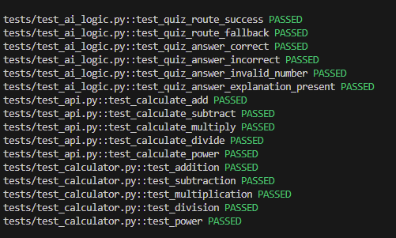

# Calculator V2 – Python + FastAPI + AI Quiz Mode

The second version in my calculator app series, rebuilt from scratch with clean architecture, modern tooling, and real AI integration. Each version of this series is built in a different language or stack, and each one adds new features so I can keep leveling up as a developer.

This version includes:

- **Python OOP backend**  
- **FastAPI** for the API layer  
- **JavaScript frontend**  
- **AI-powered Quiz Mode** using OpenAI  
- **Unit tests** for calculator logic + API + AI quiz routes  
- **CI pipeline** (pytest, flake8, black)  

I’ll continue expanding this series as I grow — adding new languages, architectures, and real-world features.

---

##  Features

###  Core Calculator
- Built using a `Calculate` class with methods for add, subtract, multiply, divide, and exponent.
- Paired with a simple but clean JS frontend.
- Supports chained calculations.
- Frontend communicates with a FastAPI backend via fetch requests.

###  AI Quiz Mode (New!)

This version introduces an AI-powered math quiz:

- AI generates random math questions  
- Users can answer in a sliding drawer panel  
- Explanations are generated via OpenAI  
- Fallback logic kicks in if AI is unavailable  
- Calculator can be used to solve the question before submitting

This is just the start — I plan to expand this into:

- Real-time multiplayer quizzes using **WebSockets**
- Quiz history + performance tracking
- Leaderboards
- Timed challenges

---

## Tech Stack

### Backend
- Python 3.12  
- FastAPI  
- Pydantic  
- OpenOpenAI  
- Unit tests with pytest  

### Frontend
- HTML / CSS  
- JavaScript (vanilla)  
- Drawer UI for quiz mode  

### Dev Tools / Quality
- flake8  
- black  
- GitHub Actions CI  
- Environment variable handling (.env)  

---

##  Testing + CI/CD

This project includes:

- Tests for calculator logic  
- Tests for `/calculate` API route  
- Tests for `/quiz` and `/quiz/answer`  
- GitHub Actions CI:  
  - installs dependencies  
  - checks formatting  
  - lints with flake8  
  - runs pytest  

Everything must pass before merging.

---

##  Screenshots

---

##  How to Run Locally

### 1. Clone the repo

git clone https://github.com/your-username/fs-calculator-v2-py.git
cd fs-calculator-v2

### 2. Create Enviroment
python -m venv venv
source venv/bin/activate
venv\Scripts\activate

### 3. Install Dependencies
pip install -r requirements.txt

### 4. Set your OpenAI API key
Create a .env file:
OPENAI_API_KEY=your_key_here

### 5. Start FastAPI
uvicorn main:app --reload

---

